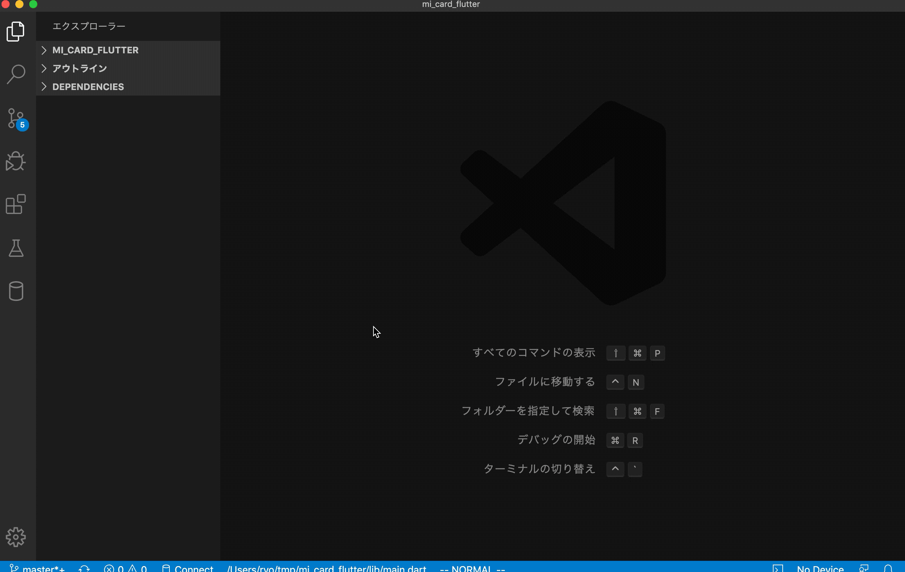

# vscode-grep

## Features

A ripgrep and fzf extension for Visual Studio Code.

## Setup

1. [Install fzf](https://github.com/junegunn/fzf)
1. [Install ripgrep](https://github.com/BurntSushi/ripgrep)

## Usage

- use shortcut `Ctrl+G`

## Release Notes

### 0.0.1

- initial
